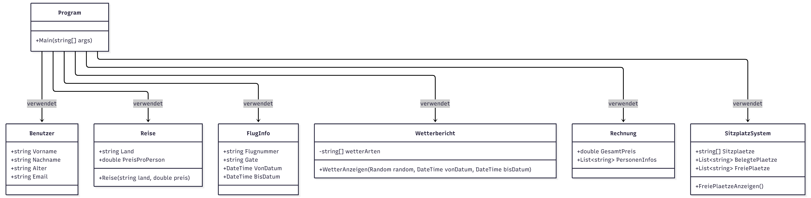

# -ReiseManager-
------------------------------------------------------------
# 1.Beginn der Planung
- Erstmals da ich noch nicht so erfahren bin habe ich mir überlegt eine Mischung aus allem zu machen was wir bisher gelernt haben. So kann man auch zeigen das man alles verstanden hat oder man versteht eher selbst, was man noch nicht beherrscht. An sich ist es eine gute Idee weil so kann man sich endlich richtig auseinander setzen mit den ganzen Themen und üben. Also kam ich auf die Idee ein Programm zu schreiben wo man Reisetickets kaufen kann.
-------------------------------------------------------------
# 2.Was soll alles im Programm enthalten sein (Grundgerüst)
- Gerne würde ich im Programm ein Loggin haben zum anmelden. Dann eine Personen Abfrage. Zudem soll gefragt werden anhand von drei festgelegten Reisezielen, welches man aussuchen möchte. Dann soll gefragt werden wie viele Personen mitkommen sollten und wie alt diese Personen seien. Da ich auch etwas einbauen möchte wie zum Beispiel Rabatt für unter 18 Jährige. Im Anschluss soll eine Rechnung erstellt werden anhand wieviele Personen fliegen.
- Gerne würde ich dazu auch hinzufügen ob man Reisegepäck oder Koffer dabei hat was dazu addiert wird. Ein Wetterbericht für den Zeitraum wo man fliegt soll auch angegeben werden. Zudem eventuell die Auswahl an einer Sitzmöglichkeit oder Zuweisung der Flugsitzplätze.
---------------------------------------------------------------
# Klassen Diagram
 

----------------------------------------------------------------
# Tag 1 
- Der erste Tag war schwierig, da ich mich um den halben Tag bemüht habe das Github einzurichten. Es war eine Fehlermeldung da die ich leider nicht wegbekommen habe. Über Visual Studio wollte ich mich mal austesten und habe es mit den Git verbunden was sich am Ende als Fehler herausgestellt hat. Also bekam ich Hilfe von den Kollgen aus der Gruppe, die eine Stunde Zeit mit mir investiert haben wofür ich Ihnen sehr dankbar bin. Denselben Fehler wieder entfernen würde ich ein zweites mal alleine bedenklich nicht alleine schaffen.
- Jetzt konnte ich anfangen zu programmieren. Also fing ich mit den an was ich einigermaßen beherrscht habe. Das loggin habe ich eingerichtet, die Personenabfrage erstellt. Da ich noch etwas Grün hinter den Ohren bin und ich das als Lernphase zum üben ausnutze, übte ich und gab mein bestes.
- Da wir solche ähnliche Aufgaben auch zuvor erstellt haben, konnte ich mich auch bei Problemen dort schlau machen. 
-------------------------------------------------------------
# Tag 2 
- Am zweiten Tag hatte ich auch etwas Probleme mit den Git da ich versucht habe mehrere Klassen zu erstellen und ich hab stattdessen mehrere Projekte geöfnnet. Als dies erledit wurde erstellte ich die Rechnung auch anhand der Programme die wir gemacht haben. Es ist noch nicht perfekt aber es erfüllt erstmal seinen Zweck.
- Heute kam ich auch auf die Ideen noch weitere Sachen hinzuzufügen wie Koffe, Sitzplatz Auswahl etc..
- Heute habe ich auch gelernt wie man weitere Klassen im selben Program macht und nun muss ich lernen diese zu verbinden.
- Zum Ende des Tages verbrachte ich es damit zu überlegen und zu probieren wie ich das mit den Wetterbericht machen könnte.
-------------------------------------------------------------
# Tag 3 
- Heute ist der Tag wo ich mich der Dokumentation gewidmet habe. Ich habe gelernt das man über ReadMe auch schreiben und dokumentieren kann.
- Paar Befehle habe ich heraus gefunden mal schauen was sich noch alles finden lässt.
- Nun gegen Ende des Tages wird noch etwas programmiert und geforscht wie man vielleicht etwas machen kann.
- Eben habe ich das mit der Sitzwahl Auswahl erledigt auch mit etwas Hilfe von Chat gpt weil ich nicht heraus gefunden habe wie man dafür sorgt das der eine Sitzplatz nicht mehr angezeigt werden soll.
- Zudem habe ich hinzugefügt ob man Handgepäck dabei hat und oder ein Koffer und falls ja, dass dieses zur Rechnung dazu addiert wird.
-------------------------------------------------------------
# Tag 4
- Heute habe ich viel recherchiert wie ich das mache mit den Wetterbericht. Ich möchte ja hinzufügen dass das Programm mir sagt zu welcher Buchungszeit ich was für ein Wetter habe.
- Diesbezüglich habe ich etwas herum experiementiert und habe versucht das zu progrmmieren.
- Leider muss ich mir noch was dazu überlegen wie ich das mache, ich nehme eventuell etwas Hilfe von einer KI.
- Zudem habe ich paar Korrekturen erledigt in meinen Programm.
- Dokumentation erweitert
- strg a, strgc, strgv, strg k+d, alt pfeil nach oben gelernt
-------------------------------------------------------------
# Tag 5
- Frisch aus den Wochenende startete ich sofort weiter mit den Wetterbericht. Hierzu habe ich heute etwas Hilfe von der Ki genommen weil ich aus eigener Stärke nicht mehr weiter gekommen bin.
- Jedoch habe ich es mir erklären lasssen und ich verstehe es einigermaßen. Doch von alleine wäre ich niemals drauf gekommen.
- Dann habe ich etwas an der Reihenfolge umgeändert im Programm und habe einige Console.Clear(); hinzugefügt. Damit es schöner aussieht.
- Die Console.Clear habe ich öfters falsch eingesetzt, welches das Programm dann so auch angezeigt hat. Immer da wo ich dachte hier wäre es richtig war es dies nicht.
- Da habe ich am Ende auch eine Ki gefragt wo man diese Commands den Einsetzen sollte.
- Zudem arbeite ich heute noch an der Dokumentation.
--------------------------------------------------------------
# Tag 6
- Heute habe ich viel weiteres im Programm gemacht und programmiert.
- Klassen wurden erstellt
- Diagram wurde erstellt
- Farben wurden hinzugefügt
- Piep Töne wurden hinzugefügt beim loggim
- Loggin wurde umgeändert auf Benutzerkonto erstellen und eigenes Passwort erstellen
- Sitzplätze Auswahl wurde angepasst
- Gate generieren zugefügt
- Flugnummer hinzugefügt
- Zudem wurde in Read Me das Diagram hinzugefügt
- Fehler ausgebessert
- Struktur angepasst
- Zum Schluss fülle ich die Dokumentation noch auf und dann sollte alles bereit zur Abgabe sein.
-------------------------------------------------------------------
## Programme die ich benutzt habe
- Visual Studio
- Github
- Lerninhalte der letzten Zeit
- Chatgpt
- Mermaid Ai
-------------------------------------------------------------------
## Struktur
ReiseProgramm/

├── Program.cs

├── Reise.cs

├── Benutzer.cs

├── FlugInfo.cs

├── Wetterbericht.cs

├── Rechnung.cs

└── SitzplatzSystem.cs

-----------------------------------------------------------------------
## Lernprogress
- Ich durfte durch dieses Projekt viel lernen was ich kann und was ich nicht kann. Vieles neues habe ich dazu gelernt. Beispielsweise wie man Farben umändert oder wie eine einzige Zeile ein Piep Geräusch erzeugen kann. Dies ist echt besonders für mich. Ich denke ich hätte vieles selber nicht zuende bringen können. Doch durch die Hilfe die ich bekommen habe war alles andere auch möglich. Das schöne dran ist, dass man sich auch alles erklären lassen kann. Es ist sehr viel neues Input für jemanden der frisch dabei ist aber ich denke das ist wie Fahrrad fahren oder seine eigene Muttersprache kennen lernen. Das braucht alles Zeit, Geduld und viel Übung. Ich hoffe, dass ich die Aufgabe erfüllt habe und freue mich auf die Bewertung und Verbesserungsvorschläge.
------------------------------------------------------------------------
